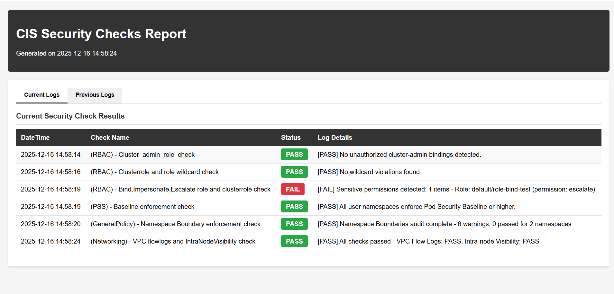

# CIS GKE Repository - Complete Setup Guide

This repository provides automated deployment of Google Kubernetes Engine (GKE) clusters with CIS Benchmark compliance checks.

## Repository Overview

The repository contains two main components:

1. **Infrastructure as Code (Terraform)**: Automates GKE cluster creation
2. **Security Compliance Scripts**: Runs CIS benchmark checks on deployed clusters

### Folder Structure

```
cis-gke/
├── gcp-gke-infr/              # Terraform configurations
│   ├── standard/              # Standard GKE cluster
│   └── autopilot/             # Autopilot GKE cluster
├── scripts/                   # Security compliance checks
│   ├── checks/                # CIS benchmark test scripts
│   ├── main.sh                # Main execution script
│   ├── generate_report.py     # Report generator
│   ├── .env.local             # Environment configuration
│   └── log.txt                # Execution logs
└── docs/                      # Documentation
```

---

## Quick Start

### Phase 1: Deploy GKE Cluster (Terraform)

#### Prerequisites

- Terraform >= 1.5.0
- gcloud CLI configured
- GCP Project with required APIs enabled:
  ```bash
  gcloud services enable compute.googleapis.com
  gcloud services enable container.googleapis.com
  ```

#### Option A: Deploy Standard GKE Cluster

1. **Navigate to standard cluster directory**:
   ```bash
   cd gcp-gke-infr/standard
   ```

2. **Configure variables** - Edit `terraform.tfvars`:
   ```hcl
   project_id    = "YOUR_PROJECT_ID"
   region        = "asia-southeast1"
   zone          = "asia-southeast1-a"
   cluster_name  = "cis-standard-cluster"
   network_name  = "gke-network-v2"
   subnet_name   = "gke-subnet-v2"
   ```

3. **Initialize and deploy**:
   ```bash
   terraform init
   terraform plan
   terraform apply
   ```

   **Deployment time**: ~10-15 minutes

#### Option B: Deploy Autopilot GKE Cluster

1. **Navigate to autopilot directory**:
   ```bash
   cd gcp-gke-infr/autopilot
   ```

2. **Configure variables** - Edit `terraform.tfvars`:
   ```hcl
   project_id       = "YOUR_PROJECT_ID"
   region           = "asia-southeast1"
   cluster_name     = "cis-autopilot-cluster"
   network          = "default"
   subnetwork       = null
   released_channel = "REGULAR"
   ```

3. **Initialize and deploy**:
   ```bash
   terraform init
   terraform plan
   terraform apply
   ```

   **Deployment time**: ~7-10 minutes

#### Verify Cluster Deployment

```bash
# Get credentials
gcloud container clusters get-credentials CLUSTER_NAME --zone ZONE --project PROJECT_ID

# Verify connection
kubectl cluster-info
kubectl get nodes
```

---

### Phase 2: Run Security Compliance Checks (Cloud Shell)

#### Step 1: Configure Environment

1. **Open Cloud Shell** in GCP Console
2. **Clone or download this repository**:
   ```bash
   git clone <repository-url>
   cd cis-gke/scripts
   ```

3. **Update `.env.local`** with your cluster details:
   ```bash
   CLUSTER_NAME=""
   REGION=""
   ZONE=""
   PROJECT_ID=""
   SUBNET=""
   ```

#### Step 2: Execute Security Checks

1. **Run the main script**:
   ```bash
   cd scripts
   bash main.sh
   ```

2. **Confirm execution** when prompted:
   ```
   Do you want to run all checks? (yes/no): yes
   ```

3. **Wait for completion** (~2-5 minutes)

#### Step 3: Review Results

**Option A: View logs in terminal**:
```bash
cat log.txt
```

**Option B: Download HTML report**:
1. Check file list:
   ```bash
   ls -la
   ```
2. Download `report.html` from Cloud Shell
3. Open in web browser for interactive report

---

## 📊 Security Checks Included

The `main.sh` script runs the following CIS Kubernetes Benchmark checks:

| Check ID | Description | Category |
|----------|-------------|----------|
| **cis_4.1.1.sh** | Ensure cluster-admin is only used where required | RBAC |
| **cis_4.1.3.sh** | Minimize wildcard use in Roles and ClusterRoles | RBAC |
| **cis_4.1.7.sh** | Limit use of Bind, Escalate, Impersonate permissions | RBAC |
| **cis_4.2.1.sh** | Ensure Pod Security Standard Baseline enforcement | Pod Security |
| **cis_4.6.1.sh** | Ensure Namespace Boundaries are enforced | Network Policy |
| **cis_5.4.1.sh** | Check VPC Flow Logs and Intra-node Visibility | Networking |

---

## Log and Report Details

### Log File Format (`log.txt`)

```json
[
  {
    "datetime": "2024-01-15 10:30:45",
    "name": "cis_5.4.1.sh",
    "status": "PASS",
    "log": "Security check passed"
  },
  {
    "datetime": "2024-01-15 10:31:45",
    "name": "cis_4.1.3.sh",
    "status": "FAIL",
    "log": "Failed: Invalid permissions detected"
  }
]
```



### Report Features (`report.html`)

**Current Logs Tab**

- All recent security check results
- Color-coded status (Green=PASS, Red=FAIL)
- Detailed log messages

**Previous Logs Tab** (if available)

- Historical results for comparison
- Track improvements over time

---

## Troubleshooting

### Issue: "Missing .env.local"
**Solution**: Create `.env.local` in `scripts/` directory with required variables

### Issue: "Lỗi khi lấy credentials"
**Solution**: 
```bash
# Verify cluster exists
gcloud container clusters list --zone ZONE

# Manually get credentials
gcloud container clusters get-credentials CLUSTER_NAME --zone ZONE --project PROJECT_ID
```

### Issue: Scripts return permission errors
**Solution**:
```bash
# Make scripts executable
chmod +x checks/*.sh
chmod +x main.sh
```

### Issue: Terraform apply fails
**Solution**:
```bash
# Enable required APIs
gcloud services enable compute.googleapis.com container.googleapis.com

# Check project quotas
gcloud compute project-info describe --project=PROJECT_ID
```

---

## Example Workflow

### Complete Setup (Start to Finish)

```bash
# 1. Deploy cluster
cd gcp-gke-infr/standard
terraform init
terraform apply -auto-approve
cd ../../scripts

# 2. Update environment
nano .env.local  # Edit with your values

# 3. Run security checks
bash main.sh
# Type: yes

# 4. View results
cat log.txt

# 5. Download report
# Download report.html from Cloud Shell file browser
```

---

## Cleanup

### Destroy Infrastructure

```bash
cd gcp-gke-infr/standard  # or autopilot
terraform destroy -auto-approve
```

This will delete:
- GKE cluster
- VPC network and subnets
- Node pools
- All deployed resources

---

## Additional Resources

- [Standard Cluster Documentation](gcp-gke-infr/standard/STANDARD.md)
- [Autopilot Cluster Documentation](gcp-gke-infr/autopilot/AUTOPILOT.md)
- [CIS Kubernetes Benchmark](https://www.cisecurity.org/benchmark/kubernetes)

---

## Security Best Practices

- Store sensitive data in `.env.local` (gitignored)
- Review `terraform.tfvars` before applying
- Run security checks after each cluster update
- Monitor `report.html` for compliance drift
- Keep logs for audit trail

---

For issues or questions:
1. Check [Troubleshooting](#-troubleshooting) section
2. Review logs: `cat log.txt`
3. Check Terraform state: `terraform show`
4. View GCP console for cluster status
